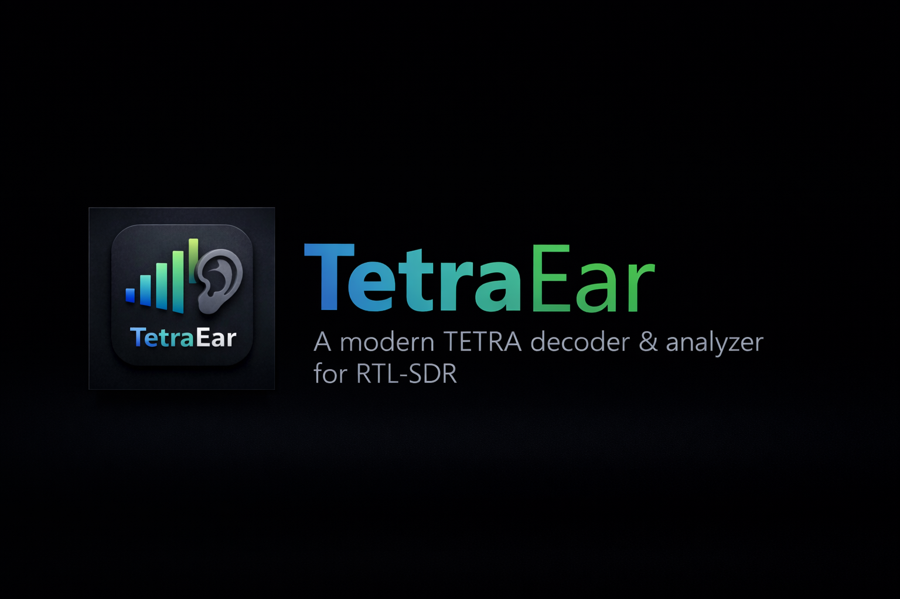

# 📡 TetraEar - Professional TETRA Decoder



[](LICENSE)
[](https://www.python.org/)
[](#)

> 🎯 A modern, professional TETRA (Terrestrial Trunked Radio) decoder and analyzer for RTL-SDR with real-time voice decoding, encryption support, and an intuitive GUI.

---

## ✨ Features

### 🖥️ **Modern GUI**
- **Professional Dark Theme**: shadcn/ui inspired interface
- **Real-time Waterfall**: High-performance spectrum display (~60 FPS)
- **Intuitive Controls**: Click-to-tune, zoom, and frequency tracking (AFC)
- **Live Status**: Real-time signal strength, sync rate, and CRC validation

### 🔊 **Voice Decoding**
- **ACELP Codec**: Integrated TETRA voice decoder (requires cdecoder.exe)
- **Real-time Audio**: Monitor decoded voice in real-time
- **Quality Validation**: Automatic amplitude check (configurable)
- **Recording**: Save decoded audio to WAV files

### 🔐 **Encryption Support**
- **Auto-Detection**: Identifies TEA1/TEA2/TEA3/TEA4 encryption
- **Smart Decryption**: Automatic bruteforce with common/weak keys
- **Key Management**: Load custom keys from file
- **Validation**: CRC checking and plaintext verification

### 📊 **Data Analysis**
- **SDS Decoding**: Short Data Service text message extraction
- **Multi-frame Assembly**: Automatic reassembly of fragmented messages
- **Call Metadata**: Talkgroup ID, SSI (subscriber), call type tracking
- **Advanced Filtering**: Dropdown-based filters for Calls, Groups, Users, and Message Types
- **Real-time Statistics**: Frame counts, sync rate, encryption stats

### 🎛️ **Spectrum Analyzer**
- **Waterfall Display**: Real-time frequency visualization
- **AFC (Auto Frequency Control)**: Automatically centers on signal peak
- **Click-to-Tune**: Ctrl+Click to tune to peak frequency
- **Zoom Controls**: Top, bottom, and threshold adjustments
- **Auto Sliders**: Dynamic zoom/threshold calibration for optimal visibility
- **Denoising**: Built-in noise reduction (configurable)

### 🛠️ **Developer-Friendly**
- **CLI Mode**: Run without GUI using `--no-gui` flag
- **Rich Logging**: Color-coded console output
- **Debugging**: Logs/recordings live in the user data directory (override with `TETRAEAR_DATA_DIR`)
- **API**: Modular design for easy integration

---

## 📋 Requirements

- **Python**: 3.8 or higher
- **RTL-SDR**: Compatible USB dongle with drivers installed
- **Operating System**: Windows or Linux
- **Optional**: TETRA Codec binaries (cdecoder.exe) for voice decoding

---

## 🚀 Installation

### 1️⃣ Clone the Repository
```bash
git clone https://github.com/syrex1013/TetraEar.git
cd TetraEar
```

### 2️⃣ Install Dependencies
```bash
pip install -r requirements.txt
```

### 3️⃣ (Optional) Install TETRA Codec
Place `cdecoder.exe` and `sdecoder.exe` in `tetraear/tetra_codec/bin/` directory, or run:
```bash
python -m tetraear.tools.install_tetra_codec
```

### 4️⃣ Verify Installation
```bash
python -m tetraear.tools.verify_codec
```

---

## 🎮 Usage

### GUI Mode (Recommended)
```bash
python -m tetraear
```

### CLI Mode
```bash
python -m tetraear --no-gui -f 392.225 --auto-start
```

### Command-Line Options
```
-h, --help              Show help message
-f, --frequency         Frequency in MHz (default: 390.865)
-g, --gain              RF gain in dB (default: 50.0)
-s, --sample-rate       Sample rate in MHz (default: 2.4)
--auto-start            Automatically start capture on launch
-m, --monitor-audio     Enable audio monitoring
--scan START STOP       Scan frequency range first
--auto-decrypt          Enable auto-decryption (default: enabled)
-v, --verbose           Enable verbose logging
--no-gui                Run in CLI mode without GUI
```

### Examples
```bash
# Launch GUI with specific frequency
python -m tetraear -f 392.225

# Auto-start capture with audio monitoring
python -m tetraear -f 392.225 --auto-start -m

# Run in CLI mode
python -m tetraear --no-gui -f 392.225 -g 35

# Scan frequency range then launch GUI
python -m tetraear --scan 390 392
```

---

## ⚙️ Configuration

### Settings Menu (GUI)
Click the **⚙️ Settings** button to access:
- **Audio Device**: Select output device for monitoring
- **Delete Silent Files**: Auto-remove recordings with zero amplitude
- **Max Recordings**: Limit number of saved audio files
- **Log Level**: Adjust logging verbosity

### Frequency Presets
- **Save Frequencies**: Click **📍 Save Freq** to save current frequency with label
- **Load Presets**: Select from saved frequencies in dropdown
- **Export/Import**: Manage presets in `settings.json`

### Key Management
1. Click **🔑 Load Keys** button
2. Create `keys.txt` with format:
   ```
   # TEA1 Keys (80-bit, 10 bytes)
   00:11:22:33:44:55:66:77:88:99
   
   # TEA2 Keys (128-bit, 16 bytes)
   00:11:22:33:44:55:66:77:88:99:AA:BB:CC:DD:EE:FF
   ```

---

## 📊 Tabs Overview

### 📜 Decoded Frames
- View all decoded TETRA frames
- Filter by type (MAC-RESOURCE, MAC-FRAG, MAC-BROADCAST, etc.)
- **Decrypted/Text Only**: Show only successfully decrypted or clear text messages
- Real-time frame updates with encryption status

### 📞 Calls
- Active and historical call list
- Filter by group or client SSI
- Call duration and status tracking

### 👥 Groups
- Talkgroup activity monitoring
- Filter groups by name
- Member count and call statistics

### 👤 Users
- Subscriber (SSI) tracking
- Filter by group membership
- Activity history per user

### 📝 Log
- Real-time application logs
- Color-coded by severity
- Filter by log level
- Exports to the user data directory (override with `TETRAEAR_DATA_DIR`)

### 📈 Statistics
- Total frames decoded
- Sync rate and CRC success rate
- Encryption statistics (per algorithm)
- Voice frame count
- SDS message count

---

## 🔍 Tips & Tricks

### 🎯 Finding TETRA Signals
1. Use **SCAN** mode to sweep frequency range
2. Look for strong, consistent spikes in waterfall (~25 kHz wide)
3. TETRA signals typically appear as 4 carriers (4x6.25 kHz slots)
4. Enable **Follow Frequency (AFC)** to auto-track signal

### 🔊 Voice Decoding
- Ensure `cdecoder.exe` is in `tetraear/tetra_codec/bin/`
- Check **Monitor Audio** to hear decoded voice
- Adjust gain (45-50 dB recommended)
- Voice frames appear with 🔊 icon in Decoded Frames tab

### 🔐 Decryption
- **Auto-Decrypt** tries common keys automatically
- Load custom keys using **Load Keys** button
- Successfully decrypted frames show ✅ in Status column
- Use **Decrypted/Text Only** filter to view plaintext only

### 📡 Optimal Settings
- **Frequency**: 390-395 MHz (varies by region)
- **Gain**: 45-50 dB (adjust based on signal strength)
- **Sample Rate**: 2.0-2.4 MHz (higher for better quality)
- **Bandwidth**: 25000 Hz (standard TETRA channel)

---

## 🛠️ Troubleshooting

### ❌ No Signal Detected
- **Check Frequency**: Verify TETRA frequency for your region
- **Adjust Gain**: Try 45-50 dB
- **Check Antenna**: Ensure proper connection and positioning
- **Sample Rate**: Use 2.0-2.4 MHz

### ❌ Low Sync Rate (< 80%)
- **Increase Gain**: Weak signal requires higher gain
- **Adjust Threshold**: Lower threshold in Spectrum Display
- **Check Antenna**: Improve signal reception
- **Frequency Drift**: Enable AFC (Follow Frequency)

### ❌ CRC Failures (0%)
- **Wrong Frequency**: Not a valid TETRA signal
- **Low Signal**: Increase gain or improve antenna
- **Interference**: Try different location or frequency

### ❌ No Voice Audio (Amplitude 0.0)
- **Codec Missing**: Verify `cdecoder.exe` exists
- **Encrypted Voice**: Load decryption keys
- **Wrong Frame Type**: Verify it's a Traffic/Voice frame

### ❌ Encrypted Frames Not Decrypting
- **No Keys Loaded**: Load keys using **Load Keys** button
- **Wrong Algorithm**: Check detected encryption type (TEA1/2/3/4)
- **Unknown Key**: Signal uses unique/proprietary key

---

## 📁 Project Structure

```
Tetra/
├── tetraear/               # Application package root
│   ├── assets/             # Icons, banner, UI resources
│   ├── bin/                # Runtime DLLs
│   ├── tetra_codec/        # TETRA ACELP codec binaries
│   │   └── bin/
│   ├── tools/              # Build + packaging tools
│   ├── core/
│   ├── signal/
│   ├── audio/
│   └── ui/
├── tests/                  # Unit + integration tests
├── requirements.txt
└── README.md
```

---

## 🤝 Contributing

Contributions are welcome! Please:
1. Fork the repository
2. Create a feature branch (`git checkout -b feature/amazing-feature`)
3. Commit your changes (`git commit -m 'Add amazing feature'`)
4. Push to the branch (`git push origin feature/amazing-feature`)
5. Open a Pull Request

---

## 📜 License

This project is licensed under the MIT License. See [LICENSE](LICENSE) file for details.

---

## ⚠️ Legal Disclaimer

**IMPORTANT**: This software is intended for educational and research purposes only.

- ⚠️ **Know Your Laws**: Intercepting radio communications may be illegal in your jurisdiction
- 🔒 **Respect Privacy**: Do not decode or disseminate private communications
- 📜 **Compliance**: Ensure you have proper authorization before monitoring any radio system
- ⚖️ **Responsibility**: Users are solely responsible for compliance with local laws and regulations

**The authors and contributors assume no liability for misuse of this software.**

---

## 🙏 Acknowledgments

- **TETRA Standard**: ETSI EN 300 392 series
- **RTL-SDR Project**: For making SDR accessible
- **OpenEar Project**: Inspiration for encryption handling
- **telive**: Reference TETRA decoder implementation
- **Community**: Thanks to all contributors and testers

---

## 📞 Contact & Support

- **GitHub Issues**: [https://github.com/syrex1013/TetraEar/issues](https://github.com/syrex1013/TetraEar/issues)
- **Author**: [syrex1013](https://github.com/syrex1013)

---

## 🔗 Resources

- [ETSI TETRA Standards](https://www.etsi.org/technologies/tetra)
- [TETRA Air Interface Specifications](https://www.etsi.org/deliver/etsi_en/300300_300399/30039502/01.03.00_40/en_30039502v010300o.pdf)
- [telive Documentation](https://github.com/sq5bpf/telive/blob/master/telive_doc.txt)
- [DSP Blog: TETRA Demodulation](https://dsplog.com/2010/04/12/non-coherent-demodulation-of-pi4-dqpsk-tetra/)

---

**Made with ❤️ by the TETRA community**
